<!-- DRAFT-BANNER-START -->
> ⚠️ **WORKING DRAFT — for the next release.** Edit *this* file (`MANUAL.draft.md`) for every user-facing change as it lands. The **released** manual is `MANUAL.md` — do **not** edit it directly; `scripts/cut_release.sh` promotes this draft into `MANUAL.md` (banner stripped) at release time. Tracked for history/backup, but it is not the published manual until a release.
<!-- DRAFT-BANNER-END -->

# The dAVEBOx Manual

dAVEBOx is a **MIDI sequencer for the Ableton Move**. It records, arranges, and
plays back MIDI — notes and automation — and sends it to an instrument. It makes
no sound of its own: the sound comes from whatever each track is pointed at, which
is one of Move's own instruments, a Schwung effect chain, or an external synth on
the USB-A port.

dAVEBOx runs inside [Schwung](https://github.com/charlesvestal/schwung) and takes
over Move's pads, knobs, and screen while it's open. It borrows Move's vocabulary —
tracks, clips, and sets — and a **Like Move** note flags where something works as
it does on Move.

> 🚀 **New here?** The [**Quick Start guide**](QUICKSTART.md) walks you from a
> blank set to a running arrangement in about fifteen minutes. This manual is the
> full reference.

---

## Contents

1. [Overview](#1-overview)
2. [Connect & Configure](#2-connect--configure)
3. [Operating the Sequencer](#3-operating-the-sequencer)
4. [Tracks](#4-tracks)
5. [Track View](#5-track-view)
6. [Melodic Clips](#6-melodic-clips)
7. [Drum Clips](#7-drum-clips)
8. [The Conductor](#8-the-conductor)
9. [Clip Timing & Grid](#9-clip-timing--grid)
10. [Effects](#10-effects)
11. [Automation](#11-automation)
12. [Arranging](#12-arranging)
13. [Performance Mode](#13-performance-mode)
14. [Routing & Sync](#14-routing--sync)
15. [Bake, Merge & Export](#15-bake-merge--export)
16. [Settings & Sets](#16-settings--sets)
17. [The Browser Editor](#17-the-browser-editor)
18. [Quick Reference](#18-quick-reference)

---

# 1. Overview

## How a dAVEBOx set is built

Everything in dAVEBOx nests like this:

- A **note** (or an automation point) sits on a **step** — one slot of a clip's grid.
- A run of steps makes a **clip** — the basic unit you program and play. A clip
  also carries its own [effects](#10-effects) and [automation](#11-automation).
- A **track** holds **16 clips** and points at one instrument. Only one of its
  clips plays at a time.
- A **scene** is one clip from each of the 8 tracks, launched together.
- The whole thing is saved inside the **Move set**.

> **Like Move:** tracks, clips, and sets are the same objects you already know
> from Move. (Scenes are dAVEBOx's own.) dAVEBOx replaces Move's sequencer, not its
> instruments.

## The two views

You work in one of two views and switch between them with **Note/Session**:

| | Track View | Session View |
|---|---|---|
| For | Building one clip in detail | Launching and arranging clips |
| Pads | Play notes / drum lanes | The clip grid |
| Steps | The clip's steps | Scene launchers |

## Three kinds of track

Each track is one of three types. The type sets how you enter notes and how the
track sequences them:

| Type | How it works |
|---|---|
| **Melodic** | Scale-snapped notes on the pads and steps — see [Melodic Clips](#6-melodic-clips) |
| **Drum** | The pads become 32 drum lanes, each its own step sequence — see [Drum Clips](#7-drum-clips) |
| **Conductor** | Plays no notes of its own; it transposes the other tracks live — see [The Conductor](#8-the-conductor) |

---

# 2. Connect & Configure

## Point each track at an instrument

dAVEBOx reaches its instruments over MIDI channels, so Move and Schwung each need
to listen on a matching channel. **This is a one-time setup.**

**On Move** — set tracks 1–4 to receive on channels 1–4, and turn each track's
MIDI **Out** off:

| Move track | MIDI In | MIDI Out |
|---|---|---|
| 1 | Ch 1 | Off |
| 2 | Ch 2 | Off |
| 3 | Ch 3 | Off |
| 4 | Ch 4 | Off |

**In Schwung** — set slots 1–4 to receive on channels 5–8, with each slot's
Forward Channel set to **Auto**:

| Schwung slot | Receive channel |
|---|---|
| 1 | Ch 5 |
| 2 | Ch 6 |
| 3 | Ch 7 |
| 4 | Ch 8 |

The result is the default routing: **tracks 1–4 play Move instruments** and
**tracks 5–8 play Schwung chains**. Any track's channel and route can be changed
later — see [Routing & Sync](#141-instruments--routing).

## Open dAVEBOx

Load a Move set, then launch dAVEBOx from Schwung's tool menu — **Shift + Step 13**
(the star).

## Set tempo, key, and scale

These live in the **Settings menu** (**Shift + Note/Session**):

- **BPM** sets the tempo.
- **Key** and **Scale** set the root and scale that melodic tracks snap to.

Changing Key or Scale offers to move your existing notes with it — see
[Key & Scale](#162-key--scale).

---

# 3. Operating the Sequencer

## 3.1 The controls

While dAVEBOx is open, Move's controls map like this:

```
   ┌─────────────────────────────────────────┐
   │              OLED screen                │   Volume
   └─────────────────────────────────────────┘

  Jog     ①   ②   ③   ④   ⑤   ⑥   ⑦   ⑧      ← eight knobs

       ┌──┐   ┌──┬──┬──┬──┬──┬──┬──┬──┐
       │  │   │  │  │  │  │  │  │  │  │   top row
     4 side   ├──┼──┼──┼──┼──┼──┼──┼──┤
     buttons  │  │  │  │  │  │  │  │  │   4 × 8 pad grid
       │  │   ├──┼──┼──┼──┼──┼──┼──┼──┤
       └──┘   │  │  │  │  │  │  │  │  │   bottom row
              └──┴──┴──┴──┴──┴──┴──┴──┘

            [ 1][ 2][ 3][ 4] … [13][14][15][16]   ← 16 step buttons
```

| Control | Role |
|---|---|
| **Knobs 1–8** | Adjust the active bank's parameters. |
| **Jog** | Turn to cycle parameter banks and scroll lists. |
| **Volume** | Master output level. |
| **Pad grid** | Plays notes and drum lanes, or shows the clip grid. |
| **Side buttons** | Switch clips on the active track. |
| **Step buttons 1–16** | Show the active clip's steps, or launch scenes. |

The **named buttons** — Play, Record, Loop, Mute, Delete, Copy, Capture, Sample,
Undo, Note/Session, Shift, +/−, and the arrows — each have their own job (covered where
it comes up) and double as *modifiers* when held with another control. A held
combination is written "**Modifier + X**" (for example, **Shift + Note/Session**).
The full list of gestures is in the [Quick Reference](#18-quick-reference).

## 3.2 Transport

**Play** starts and stops the sequencer. By default the sequencer runs on
dAVEBOx's own clock; it can instead lock to Move's transport or send clock to
external gear — see [Routing & Sync](#144-clock-follow).

## 3.3 Switching views

Tap **Note/Session** to switch between Track View and Session View; hold it to
peek at the other view without leaving.

## 3.4 Selecting a track

There are no dedicated track buttons. Change the active track with:

| Gesture | Works in |
|---|---|
| **Shift + jog turn** | Both views |
| **Shift + bottom-row pad (1–8)** | Track View |
| **Tap a pad in a column** | Session View |

A box around a track number marks the active track.

## 3.5 Parameter banks

In Track View, the eight knobs control a **bank** of parameters, and the **jog**
cycles through the banks. Which banks exist depends on the track type; they are
covered in [Clip Timing & Grid](#9-clip-timing--grid), [Effects](#10-effects), and
[Automation](#11-automation).

- **Touch** a knob to see its full name and current value; **turn** it for a large
  read-out. The LED under a knob lights when its parameter is set away from default.
- **Click the jog** to switch a bank between its primary and alternate parameters
  (the labels change). A **down-arrow** in the header marks any bank that has
  alternates, and blinks while the alternates are showing. Click again, or change
  bank or track, to return to the primary set.
- The bank display falls back to a track overview after a moment. **Touch the jog**
  to bring it back.

## 3.6 The Settings menu

**Shift + Note/Session** opens the Settings menu — the active track's settings
first, then the session-wide settings. The full list is in
[Settings & Sets](#16-settings--sets), and many settings have a **Shift + Step**
shortcut (see the [Quick Reference](#18-quick-reference)).

## 3.7 Saving, suspending & exiting

dAVEBOx saves your set automatically whenever you leave it:

| Action | Result |
|---|---|
| **Hold Back** (~½ s) | Suspend — dAVEBOx keeps playing in the background |
| **Shift + Back** | Exit to Schwung |
| **Settings menu → Quit** | Exit to Schwung |

There is no manual "save." For named backups you can return to, use
[Save state](#163-snapshots).

---

# 4. Tracks

dAVEBOx has **8 tracks**. Each holds **16 clips**, plays one clip at a time, and
points at one instrument (its channel and route — see
[Routing & Sync](#141-instruments--routing)).

## 4.1 Track type

A track's **type** sets how you enter notes into it and how it sequences them. Set
it in the Settings menu under **Mode**, where scrolling previews the candidate type
and clicking commits it:

| Type | Menu label | How it works |
|---|---|---|
| Melodic | `Keys` | Scale-snapped notes on the pads and steps — [Melodic Clips](#6-melodic-clips) |
| Drum | `Drums` | 32 drum lanes, each its own step sequence — [Drum Clips](#7-drum-clips) |
| Conductor | `Conduct` | Plays no notes of its own; transposes the other tracks — [The Conductor](#8-the-conductor) |

Melodic is the default. A track keeps its color, clips, and routing whatever its
type.

## 4.2 Changing type

Changing type **carries your notes** across all 16 clips (their pitch, length, and
per-step conditions), but **resets effects, arpeggiators, and automation** to
defaults.

- **Melodic ↔ Drum** asks you to confirm when the track holds notes. An empty
  track switches at once.
- **To or from Conductor** keeps your notes and is only available with the
  transport stopped. Only one Conductor can exist in a set at a time.

---

# 5. Track View

Track View is where you build one clip in detail. It always shows the **active
track's** current clip:

- The **pads** play the track's notes (melodic) or trigger its drum lanes.
- The **16 step buttons** hold the clip's pattern.
- The **jog** cycles the [parameter banks](#35-parameter-banks) that shape the clip.

What goes into a clip is covered per track type in [Melodic Clips](#6-melodic-clips)
and [Drum Clips](#7-drum-clips). Two things belong to Track View itself: switching
clips, and muting the track.

## 5.1 Switching clips

The four **side buttons** (left of the pads) switch the active track's clips — they
follow the four clip rows currently shown in [Session View](#12-arranging), and the
lit button is the clip you're editing.

Manage that clip with the side buttons:

| Gesture | Result |
|---|---|
| **Copy + side button**, then another | Copy the clip to that slot |
| **Delete + side button** | Clear its notes (and free its length for the next recording) |
| **Shift + Delete + side button** | Reset it — notes and all parameters |

## 5.2 Muting the track

**Mute** silences the active track, **Shift + Mute** solos it, and **Delete + Mute**
clears every mute and solo. A muted track goes quiet, but a live pad you hold still
plays through. (In Session View you mute each track from its clip pads — see
[Arranging](#123-mute--solo).)

---

# 6. Melodic Clips

A melodic clip is a sequence of scale-snapped notes on a step grid. This chapter
covers writing, editing, and recording into one; the [Effects](#10-effects) and
[Automation](#11-automation) that shape it have their own chapters.

## 6.1 Playing and placing notes

The pads play notes from the current [key and scale](#162-key--scale). **+ / −**
shifts the pad octave. To place notes on the grid, use the **16 step
buttons**:

| Action | Result |
|---|---|
| Tap an empty step | Places the last note you played, at velocity 100 |
| Tap a filled step | Clears it |
| Hold a step | Opens [note edit](#63-editing-notes) (an empty step is filled first) |
| Tap several steps together | Toggles each |
| **Copy + step → another step** | Copy the step's notes (same clip) |
| **Delete + step** | Clear the step |

Steps past the clip's length are dimmed. (These step gestures work on drum steps
too — see [Drum Clips](#7-drum-clips).)

**Pad layout.** By default the pads show only in-scale notes, with the root in the
track color (`Keys` layout). **Shift + Step 8** switches to a chromatic layout —
all 12 semitones, with the in-scale notes highlighted. The **Layout** setting in
the Settings menu does the same.

## 6.2 Chords

A step holds up to **eight notes**. Build a chord two ways:

- **Pads first:** hold one or more pads, then press a step.
- **Step first:** hold a step, then tap pads one at a time. Tap a held note again
  to remove it.

## 6.3 Editing notes

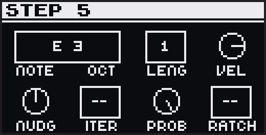

Hold a step to edit its notes. Edits apply to every note in the step; hold several
steps to edit them together. While holding a step, **+ / −** moves the octave
range so you can reach higher or lower notes.

| Knob | On screen | Adjusts |
|---|---|---|
| 1 | `Note` | Pitch, by scale degree |
| 2 | `Oct` | Pitch, by octave |
| 3 | `Leng` | Note length (gate) |
| 4 | `Vel` | Velocity |
| 5 | `Nudg` | Timing, up to ±1 step |
| 6 | `Iter` | Iteration (below) |
| 7 | `Prob` | Probability (below) |
| 8 | `Ratch` | Ratchet (below) |

### Per-step conditions

Three settings decide *whether and how* a step fires. Each defaults to `--` (off):

- **Iteration** (`Iter`) plays the step only on certain passes of the loop. `2:3`
  plays on the 2nd pass of every three. The counter resets on a cold start (Stop →
  Play).
- **Probability** (`Prob`) gives the step a chance of playing, from 100 % down to
  1 %. The roll is per note, so chords thin out unevenly.
- **Ratchet** (`Ratch`) retriggers the step 2, 3, or 4 times within its slot.

They stack in that order: iteration decides if the step plays, probability rolls
per note, and a note that plays fires all its ratchets.

## 6.4 Recording

Press **Record** to play notes into the active clip in real time.

| Transport | What happens |
|---|---|
| Stopped | A 1-bar count-in, then recording and playback start together |
| Playing a fixed-length clip | Records from the current position |
| Playing an empty clip | Arms, and starts at the next bar — Record blinks until then |

Recording adds to what's there; it never erases. For a clean take, clear the clip
first (**Delete + side button**), which also frees its length so the take sizes
itself to what you play. Notes played in the last half-beat of the count-in land
on step 1. You can switch tracks mid-take — recording follows the active track.

Recording runs in the **Forward** [playback direction](#91-clip-bank). A clip set
to another direction offers to bake itself to Forward first.

## 6.5 Capture

dAVEBOx is always listening. Everything you play on the pads while a track is not
recording is held in a buffer, so if you play something you want to keep, tap
**Capture** and it becomes real clip data. The Capture button lights bright while
there is buffered input to keep.

> **Like Move:** this is Move's Capture — play first, keep it after.

What Capture does depends on the transport:

| Transport | What Capture does |
|---|---|
| Playing | Adds the buffered notes to the active clip where you played them; knob moves become [automation](#11-automation) |
| Stopped, empty set | Reads a tempo from your playing, sizes a clip to whole bars, and starts it |
| Stopped, set with clips | Fits the take to the current tempo; a screen lets the jog pick how many bars it fills |

After a stopped capture into an empty set, a tempo chooser offers the detected BPM
and a few nearby candidates over a strip showing your take against the bars —
playback keeps rolling as you scroll them, so you can hear which one fits. Capture
works on drum clips too. To clear the buffer, hold **Shift** and tap **Capture**.

## 6.6 Clip length & the loop

A clip runs up to **256 steps**, shown as **pages** of 16. **Left / Right** moves
between pages, and **Loop + jog** changes the clip length by a step.

Hold **Loop** for the **loop view**, where the step buttons stand for pages — a
page inside the loop lights in the track color (pulsing if it holds notes). While
Loop is held:

| Gesture | Sets the loop to |
|---|---|
| Jog ±1 | Grow or shrink from the end |
| Tap a page | Page 1 through the tapped page |
| Hold one page, tap another | The range between them |

Notes outside the loop are kept and return when you widen it.

## 6.7 Undo

**Undo** reverses the last edit; **Shift + Undo** repeats it. It covers step and
clip edits, copy and clear, recording, bakes, and more.

---

# 7. Drum Clips

On a drum track, each sound is a **lane** — its own step sequence with its own
length, timing, and effects. A track has **32 lanes**, each mapped to a MIDI note
that triggers one sound in the instrument.

The pad grid splits in two:

| Half | Holds |
|---|---|
| **Left 4×4** | 16 drum lanes. Tap one to hear its sound and select it — the steps then show that lane. |
| **Right 4×4** | Velocity zones, or a [note-repeat](#73-note-repeat) mode |

The left pads show 16 lanes at a time; **+ / −** switches between lane **bank
A** and **bank B** for all 32. The screen shows the active bank.

## 7.1 Placing hits

Select a lane, then tap **steps 1–16** to add or clear its hits. The steps always
show the selected lane.

**Velocity zones** (the right 4×4) set the velocity for the hits you place next —
16 zones from 8 (bottom-left) to 127 (top-right).

**A lane's sound** is set by its MIDI note, on the [NOTE FX bank](#101-note-fx):
knob 1 moves it by an octave, knob 2 by a semitone. The screen shows the note,
e.g. `Pad: C1 (36)`.

Editing a hit (length, velocity, nudge, and per-step conditions) works the same as
[note edit](#63-editing-notes), minus the two pitch knobs.

## 7.2 Per-lane loops

Each lane has its own loop length, set with **Loop + jog** on the selected lane.
A kick looping over 16 steps, a hat over 12, and a percussion lane over 10 each
cycle against the shared transport — a polyrhythm from one clip.

## 7.3 Note Repeat

Note Repeat retriggers a lane at a steady rate. **Shift + Step 8** cycles the right
pads between velocity zones and the two repeat modes.

The bottom two rows of the right pads are **rates**; the top two rows are a **gate
mask**:

```
   top row      [ gate 1 ][ gate 2 ][ gate 3 ][ gate 4 ]   gate mask
                [ gate 5 ][ gate 6 ][ gate 7 ][ gate 8 ]   (8-step loop)
                [ 1/32T  ][ 1/16T  ][ 1/8T   ][ 1/4T   ]   triplet rates
   bottom row   [ 1/32   ][ 1/16   ][ 1/8    ][ 1/4    ]   straight rates
```

- **Rpt1** repeats the **selected** lane: hold a rate pad. Velocity follows pad
  pressure, and you can change lanes while holding.
- **Rpt2** repeats **any** lane at a rate you assign it: tap a rate pad to assign
  it to the selected lane, then hold a lane pad. Hold several for layered repeats.

**Latch** keeps a repeat going after you let go: **Loop + rate pad** (Rpt1) or
**Loop + lane pad** (Rpt2). Tapping **Loop** with no pads held releases all
latches on the track; **Delete + Loop** stops them too. Latched lanes light cyan,
and stopping the transport clears them.

**The gate mask** (top two rows) is a looping on/off pattern over the repeats — all
on by default, tap to toggle. **Loop + a gate pad** sets its cycle length (1–8).
Per-step velocity and timing for the mask live in the
[REPEAT GROOVE bank](#repeat-groove).

## 7.4 Copying & muting lanes

- **Copy + lane pad**, then tap another lane to paste (the destination keeps its
  own MIDI note). **Shift + Copy** cuts.
- **Mute + lane pad** mutes a lane; **Shift + Mute + lane pad** solos it.

---

# 8. The Conductor

A **Conductor** is a track that transposes every playing melodic clip up or down
in real time, following the note it plays. It sends no MIDI of its own — its
sequence (and its live pads) only steer the transposition. The written notes on
the other tracks never change; the shift is live and reversible. **A set can hold
one Conductor at a time.**

This lets one track lead a key change or chord move across the whole arrangement:
sequence a progression on the Conductor, and every responding track follows it.

## 8.1 Creating one

Set a track's **Mode** to `Conduct` in the Settings menu (transport stopped). Its
notes carry over; its effects, arps, and automation reset. A Conductor's channel
and route are inert (shown `-`), and **Mute** pauses its conducting — the
responders snap back to their written pitch.

## 8.2 How the shift works

Zero transposition is the **session root at octave 4** — the default pad note. Play
that and nothing shifts; play higher and the responders rise, lower and they fall.
The Conductor's own octave scales the move, so an octave up on the Conductor is an
octave of transposition.

The shift follows the global **Scale Aware** setting — by scale degree (staying in
key) when it's on, by semitone when it's off. An empty Conductor step, or a muted
Conductor, holds the responders at zero. Drum tracks never respond.

## 8.3 The Conductor's banks

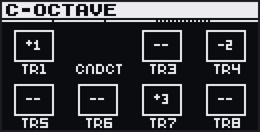

A Conductor's jog cycles five banks, each headed with a **`C-`** so you always
know you're on the Conductor:

| Bank | Controls |
|---|---|
| **Conduct** | The Conductor's own timing and direction, plus **Cond Lock** (`CdLk`): *Off* holds the shift only for each note's length; *Lock* holds it until the next Conductor note. |
| **NoteFX** | Shapes the Conductor's note before the shift is worked out — an octave, an offset, and a per-note random amount. |
| **Responder** | An on/off cell per track (`Tr1…Tr8`) — on means the track follows. Drum tracks read `--`. |
| **Octave** | A per-track octave (**−4…+4**) added on top of the shift while the Conductor sounds. |
| **When** | Per track: **Next** (a responder takes the shift at its next note) or **Now** (a sounding note is retriggered at the new pitch at once). |

## 8.4 Making it permanent

The Conductor's transposition can be folded into the responding clips when you
[bake a scene](#151-bake) or [export to Live](#153-export-to-live), each offering
an **Apply Conductor?** step. The Conductor track itself has no bake and exports as
a silent placeholder.

---

# 9. Clip Timing & Grid

These banks set a clip's grid, timing, and playback — **CLIP** on a melodic track,
**DRUM LANE** and **ALL LANES** on a drum track. Some parameters permanently
rewrite your notes (the **Rewrites notes** column marks which; **Undo** reverses
those); the rest only change how the clip plays.

**Resetting a bank** (this works on any bank, including [Effects](#10-effects)):

| Gesture | Result |
|---|---|
| **Delete + jog click** | Reset every parameter in the active bank |
| **Shift + Delete + jog click** | Reset all effects across every bank |
| **Shift + Delete + side button** | Reset the whole clip — notes and all parameters |

## 9.1 CLIP bank

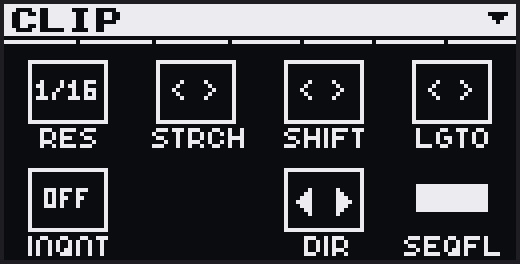

A melodic clip's grid, direction, and note transforms.

| Knob | On screen | What it does | Rewrites notes | Default |
|---|---|---|---|---|
| 1 | `Res` | **Resolution** — the step grid size, rescaling note positions. *Alt:* **Zoom** (regrid without moving notes). | Yes | 1/16 |
| 2 | `Stch` | **Stretch** — one detent doubles (right) or halves (left) the clip. | Yes | — |
| 3 | `Shft` | **Shift** — rotate all notes by whole steps. *Alt:* **Nudge** (finer). | Yes | 0 |
| 4 | `Lgto` | **Legato** — turn right to confirm; lengthens every note to reach the next. | Yes | — |
| 5 | `InQ` | **Input Quantize** — snap recorded notes to the grid. | No | Off |
| 7 | `Dir` | **Direction** — Forward, Backward, or ping-pong. *Alt:* **Reverse Style**. | No | Fwd |
| 8 | `SqFl` | **Follow** — scroll the step display to keep up with the playhead. | No | On |

**Direction** plays the clip Forward, Backward, or bouncing between the two (the
two ping-pong modes differ only in which end they start from). **Reverse Style**
(the alt of `Dir`) sets what backward playback does to each note:

- **Step** (default) reverses the *order* of the steps — each note still triggers
  at its start, so the pattern runs back-to-front but the notes sound unchanged.
- **Audio** also mirrors each note within its slot: on a backward pass the note-on
  lands at the note's end and the note-off at its start, for a tape-reverse feel.
  (In ping-pong, Audio plays the endpoints twice, so every note gets one forward
  and one reversed pass.)

Recording needs **Forward** direction; [bake](#151-bake) and
[export](#153-export-to-live) freeze the direction into the notes and reset it to
Forward.

## 9.2 DRUM LANE bank

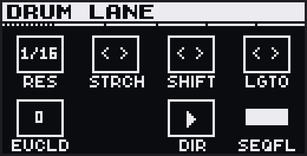

The **selected lane's** grid — the drum counterpart to the CLIP bank.

| Knob | On screen | What it does | Rewrites notes | Default |
|---|---|---|---|---|
| 1 | `Res` | **Resolution.** *Alt:* **Zoom.** | Yes | 1/16 |
| 2 | `Stch` | **Stretch.** | Yes | — |
| 3 | `Shft` | **Shift.** *Alt:* **Nudge.** | Yes | 0 |
| 4 | `Lgto` | **Legato** (this lane). | Yes | — |
| 5 | `Eucl` | **Euclid** — spread N hits evenly across the lane. Hand-placed hits stay. | Yes | 0 |
| 7 | `Dir` | **Direction.** *Alt:* **Reverse Style.** | No | Fwd |
| 8 | `SqFl` | **Follow.** | No | On |

Lane length is **Loop + jog**; the lane's MIDI note is on the
[NOTE FX bank](#101-note-fx).

## 9.3 ALL LANES bank

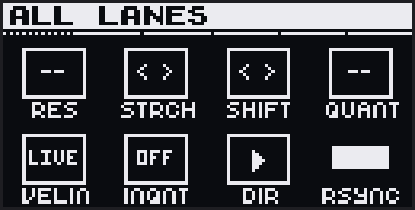

Applies one setting to **all 32 lanes** at once. Because that rewrites every lane,
the bank opens on a **"Edits will affect all lanes. Proceed?"** screen — **click
the jog to confirm** before the knobs, Loop, or the Shift + Step shortcuts do
anything.

| Knob | On screen | What it does | Rewrites notes |
|---|---|---|---|
| 1 | `Res` | **Resolution** for all lanes | Yes |
| 2 | `Stch` | **Stretch** all lanes (`NO ROOM` if any can't fit) | Yes |
| 3 | `Shft` | **Shift.** *Alt:* **Nudge.** | Yes |
| 4 | `Qnt` | **Quantize** all lanes at playback | No |
| 5 | `VelIn` | Velocity input override for the track | No |
| 6 | `InQ` | Recording input quantize for the track | No |
| 7 | `Dir` | **Direction** for all lanes. *Alt:* **Reverse Style.** | No |
| 8 | `SyncRpt` | **Repeat Sync** — held repeats wait for the beat grid (On) or fire at once (Off) | No |

---

# 10. Effects

Two kinds of processing shape notes beyond the stored clip:

- **Effects** (§9.1–9.4) reshape every note — sequenced or live — at playback, per
  clip. They are non-destructive: return a knob to its default and the clip plays
  exactly as written.
- **Live input modifiers** ([§9.5](#105-live-input-modifiers)) act only on what you
  play live, before it is sequenced. LIVE ARP is the melodic one; on drums it is
  [Note Repeat](#73-note-repeat), shaped by REPEAT GROOVE.

Everything runs the same chain — the live modifier at the front, the effects after:

```
 LIVE INPUT ──▶ [LIVE ARP / Note Repeat] ──┐
                                           ├─▶ NOTE FX ─▶ HARMONY ─▶ DELAY ─▶ SEQ ARP ─▶ OUT
 SEQUENCED NOTES ──────────────────────────┘
```

Global [swing](#161-global-settings) is applied after the chain;
[Performance Mode](#13-performance-mode) comes last.

## 10.1 NOTE FX

*Melodic & drum.*

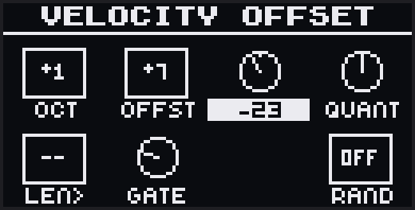

Shifts every note's pitch, velocity, timing, and length.

| Knob | On screen | What it does | Default |
|---|---|---|---|
| 1 | `Oct` | Octave shift (±4) | 0 |
| 2 | `Ofs` | Note offset — scale degrees or semitones (±24) | 0 |
| 3 | `Vel` | Velocity offset (±127) | 0 |
| 4 | `Qnt` | Quantize at playback (0–100 %) | 0 % |
| 5 | `Len>` | Fixed note length in step-multiples (`--` = as written) | -- |
| 6 | `Gate` | Scale the length — under 100 % shortens, over 100 % lengthens | 100 % |
| 8 | `Rnd` | Pitch randomness (0–24). *Alt:* Walk, Uniform, or Gaussian | 0 |

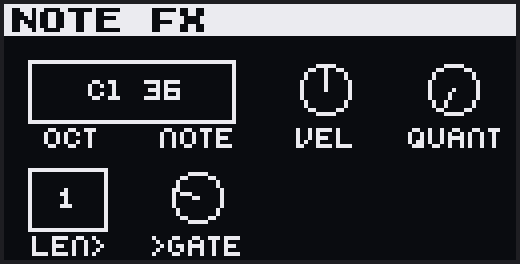

On a **drum track**, knobs 1 and 2 set the selected lane's MIDI note (octave and
semitone); knobs 3–6 apply to that lane.

## 10.2 HARMONY

*Melodic.*

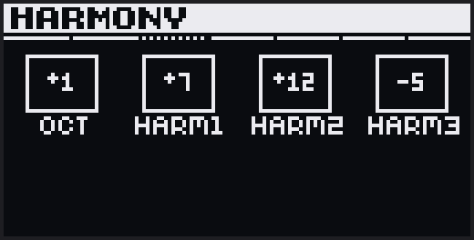

Adds voices above every note: an octave voice and three scale-aware harmony
intervals (each ±24, default 0).

## 10.3 DELAY

*Melodic & drum.*

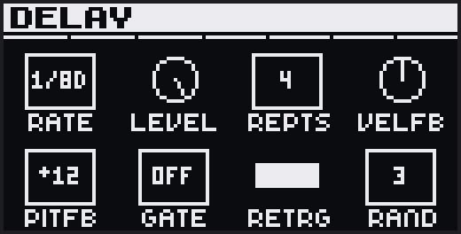

Echoes every note in rhythm.

| Knob | On screen | What it does | Default |
|---|---|---|---|
| 1 | `Rate` | Delay time (dotted and triplet values included). *Alt:* nudge each repeat | 1/8D |
| 2 | `Lvl` | Echo velocity | 127 |
| 3 | `Rep` | Number of echoes (0 = off) | 0 |
| 4 | `Vfb` | Velocity change per repeat | 0 |
| 5 | `Pfb` | Pitch change per repeat (scale-aware) | 0 |
| 6 | `Gate` | Fixed echo length (Off = natural) | Off |
| 7 | `Rtrg` | A new note clears the echoes in flight | On |
| 8 | `Rnd` | Pitch randomness on echoes. *Alt:* algorithm | 0 |

## 10.4 SEQ ARP

*Melodic. Per clip.*

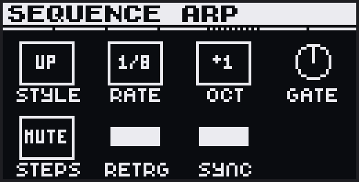

An arpeggiator running after Delay, on both sequenced and live notes.

| Knob | On screen | What it does | Default |
|---|---|---|---|
| 1 | `Styl` | Style — Up, Down, Up/Down, Converge, Diverge, Ordered, Random, and more | Off |
| 2 | `Rate` | Arp rate | 1/16 |
| 3 | `Oct` | Octave range (±4) | Off |
| 4 | `Gate` | Note length (under 100 % shortens, over lengthens) | 100 % |
| 5 | `Stps` | How silenced steps behave — rest (`Mute`) or skip (`Step`) | Mute |
| 6 | `Rtrg` | Restart the arp on each new note | On |
| 7 | `Sync` | Wait for the next rate boundary | On |

**Click the jog** for the per-step editor: knobs 1–8 set each step's pitch offset,
and with **Shift** held they set each step's velocity (`Thru` passes the incoming
velocity). The pads write coarse velocities per step, and **Loop + pad** sets the
step-loop length.

## 10.5 Live input modifiers

These shape what you play **live** — on the pads or over external MIDI — before it
is sequenced. They leave the stored clip untouched, and are a different stage from
the effects above.

### LIVE ARP

*Melodic. Per track.*

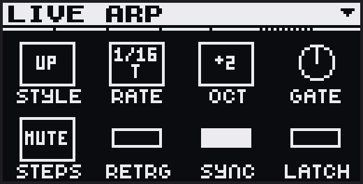

An arpeggiator for live pad and external input; it leaves sequenced notes alone.
The controls match [SEQ ARP](#104-seq-arp), plus a **Latch** (`Ltch`, knob 8) that
keeps the arp running after you release. With pads held, tapping **Loop** latches;
**Delete + Loop** unlatches. Latch survives track and channel changes and clears on
Stop. **Shift + Step 11** toggles LIVE ARP on and off with the last style.

### REPEAT GROOVE

*Drum. Per lane.*

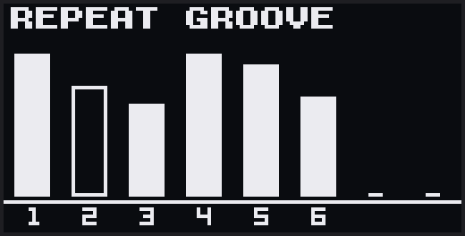

Shapes the 8-step gate mask of a lane's [Note Repeat](#73-note-repeat) — available
only while a repeat mode is active.

| Knobs | Screen page | After jog-click |
|---|---|---|
| 1–8 | **Velocity** per gate step — `Thru` (the pad's own velocity) or a value 1–127 | **Nudge** per gate step (±50 % of the step) |

**Delete + jog click** resets the selected lane's groove.

---

# 11. Automation

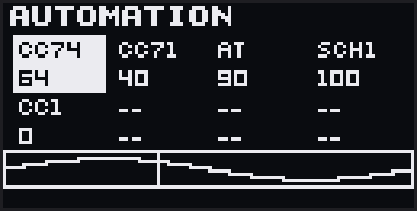

Each of the eight knobs drives an **automation lane** — a recordable stream of
control-change or aftertouch data that plays back with the clip. A lane holds up to
1024 points, smoothly joined, plus an optional resting value it returns to each
loop. The bank works the same on melodic and drum clips.

## 11.1 Choosing what a lane sends

**Click the jog** to enter assign mode, then turn a knob to pick its target:
aftertouch (`AT`), a CC number (`CC0`–`CC127`), or — on a Schwung-routed track — a
Schwung chain knob (`Sch1`–`Sch8`). The target applies to the whole track. A lane
starts at `—` (sends nothing); turn up from there to reach 0.

## 11.2 Resting values and recording

A plain turn (no step held) sets the lane's **resting value** while stopped, and
sends it live. With the transport playing and **Record armed**, turning a knob
records — it writes the knob's value at the playhead and keeps writing, loop after
loop, until you stop. Lanes you don't touch keep what they had.

## 11.3 Editing and clearing

Hold a step to see each lane's value there and turn a knob to drop a point,
starting from the shown value. Clearing:

| Gesture | Clears |
|---|---|
| **Delete** (tap) | Opens a menu to clear AT and/or CC |
| **Delete + knob** | That lane |
| **Delete + step** | Every lane at that step |
| **Delete + jog click** | All automation in the clip |

## 11.4 Per-lane loops

A lane can loop independently of the clip — a short filter sweep under a long
melody, say. **Hold Loop on this bank** (the last-touched knob is the lane):

| Gesture | Sets |
|---|---|
| Step buttons | Loop length, by page |
| Jog | Loop length, ±1 step |
| Left / Right | Resolution (below) |
| + / − | Zoom (below) |

### Resolution & zoom

- **Resolution** sets how fast the lane plays through its steps — the same
  recorded data, cycled faster or slower (a 16-step lane at 1/8 takes twice as long
  as at 1/16).
- **Zoom** sets the step-grid density — more or fewer steps over the same time
  span. Your recorded points keep their exact positions; the grid moves around them.

---

# 12. Arranging

Arranging happens in **Session View** — the clip grid on the pads, 8 tracks across
and 4 rows visible, with the jog scrolling through all 16 rows. The screen keeps
showing the active bank.

## 12.1 Launching clips

| Gesture | Result |
|---|---|
| Tap a clip | Launch or queue it |
| Tap an empty clip | Focus it for recording |
| **Shift + clip** | Open it in Track View. While stopped, a clip with notes opens without launching; an empty clip launches. |
| **Copy + clip**, then another | Copy the clip (**Shift + Copy** cuts) |
| **Delete + clip** | Delete the clip |

Launching a clip replaces whatever was playing **on that track**. Switching to a
track launches its focused clip only if that clip is empty, so you can move between
tracks without triggering the ones that hold notes. The clipboard stays loaded
after a paste, so you can paste to several slots from one source.

## 12.2 Scenes

A scene launches one clip from every track at once — tap a **scene launcher** (left
of the grid) or a **step button (1–16)**. **Shift + scene launcher** launches at
the next bar. Launching a scene switches **every** track to that row, so a track
whose clip there is empty falls silent.

| Gesture | Result |
|---|---|
| **Copy + scene launcher**, then a row | Copy all 8 clips |
| **Shift + Copy + scene launcher** | Cut the row |
| **Capture + scene launcher** | Snapshot the playing clips into the row |
| **Delete + scene launcher** | Clear the row's notes |
| **Shift + Delete + scene launcher** | Reset the row's clips |

## 12.3 Mute & solo

In Session View, mute and solo each track from its clip pads:

| Gesture | Result |
|---|---|
| **Mute + clip** | Mute the track |
| **Shift + Mute + clip** | Solo the track |
| **Delete + Mute** | Clear every mute and solo |

A muted track goes silent, but a live pad you hold still plays through. (Mute the
active track directly in [Track View](#52-muting-the-track); mute a drum lane in
[Drum Clips](#74-copying--muting-lanes).)

## 12.4 Mute snapshots

Store up to **16 mute/solo states.** In Session View, hold **Mute** and the step
buttons light (grey = empty, yellow = saved):

| Gesture | Result |
|---|---|
| **Mute + hold step** | Save the current mute/solo state |
| **Mute + tap a saved step** | Recall it |
| **Mute + Delete + step** | Clear that slot |

Snapshots persist across reboots.

## 12.5 Volume

The **Volume** knob controls Move's master output. There is no per-track volume —
set level on the instrument (the Move mixer, or the Schwung chain).

---

# 13. Performance Mode

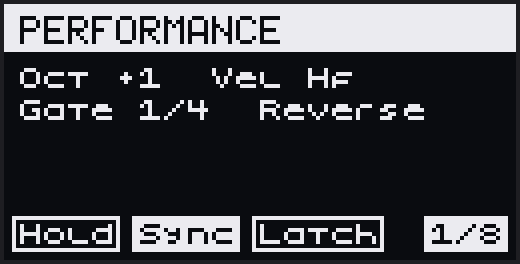

Performance Mode grabs a short loop of what's playing and lets you transform it
live from a grid of effects. It runs in **Session View**.

## 13.1 Entering and exiting

**Tap Loop** to turn it on and keep it on hands-free; **hold Loop** to use it only
while held. Switching to Track View leaves Performance Mode and keeps your mod state.

## 13.2 The grid

```
   top row      wild mods        — blue
                velocity / gate  — yellow
                pitch mods       — magenta (melodic only)
   bottom row   length · hold · sync · latch
```

The **bottom row** sets the capture length and mode:

| Pad | Sets |
|---|---|
| 1–5 | Capture length: 1/32, 1/16, 1/8, 1/4, 1/2 bar |
| 6 | **Hold** — keep the loop when you release a length pad |
| 7 | **Sync** — clock-aligned capture |
| 8 | **Latch** — sticky mods |

The three **mod rows** transform the loop. With **Latch** on, tapping a mod pad
toggles it and it stays on until you tap it again; with Latch off, a mod runs only
while you hold its pad. Press a lit pad to turn its mod off.

<details>
<summary><b>Pitch mods</b> (magenta, melodic only)</summary>

| Pad | Name | Effect |
|---|---|---|
| 1 | Oct Up | Alternates octave up / original |
| 2 | Oct Down | Alternates octave down / original |
| 3 | Scale Up | +1/+2/+3 scale degrees over 3 loops, then resets |
| 4 | Scale Down | −1/−2/−3 over 3 loops |
| 5 | Fifth | Ascending fifths |
| 6 | Tritone | 4th, 6th, octave+2nd over 4 loops |
| 7 | Drift | ±1 random walk, drifts to ±6 |
| 8 | Storm | Random ±6 scale degrees per note — chaotic, in key |

</details>

<details>
<summary><b>Velocity / gate mods</b> (yellow, all tracks)</summary>

| Pad | Name | Effect |
|---|---|---|
| 1 | Decrescendo | Velocity ×0.85 per loop |
| 2 | Swell | 16-loop triangle |
| 3 | Crescendo | Velocity ×1.15 per loop |
| 4 | Pulse | Even loops full, odd loops 20 % |
| 5 | Sidechain | −15 % per successive note in a loop |
| 6 | Staccato | Gates to 1/8 of the loop |
| 7 | Legato | Gates to the full loop |
| 8 | Ramp Gate | Gate ramps up across notes |

</details>

<details>
<summary><b>Wild mods</b> (blue)</summary>

| Pad | Name | Effect |
|---|---|---|
| 1 | Half Time | Every other loop dropped |
| 2 | 3 Skip | Every third loop dropped |
| 3 | Phantom | Ghost note an octave below, ¼ velocity |
| 4 | Sparse | ~50 % of notes dropped |
| 5 | Glitch | ±2 scale-degree shift per note |
| 6 | Stagger | Notes offset +0, +1, +2… scale degrees |
| 7 | Shuffle | Pitch/hit order shuffled each loop |
| 8 | Backwards | Pitch/hit order reversed each loop |

</details>

## 13.3 Which tracks it captures

A track feeds Performance Mode when its **Looper** setting is on
([Track settings](#164-track-settings)). While Performance Mode is locked, touch a
knob to toggle its track's Looper — the knob LED is the track color when on.

## 13.4 Presets

The **step buttons are 16 preset slots**: tap to recall, hold to save, **Delete +
step** to clear. Slots 1–8 ship with combinations (Float, Sink, Heartbeat, Fairy
Dust, Robot, Dissolve, Chaos, Lift); 9–16 are yours.

---

# 14. Routing & Sync

## 14.1 Instruments & Routing

Two settings decide where a track's MIDI goes ([Track settings](#164-track-settings)):

- **Channel** — MIDI channel 1–16 (by default track N uses channel N).
- **Route** — Move, Schwung, or External (USB-A).

The default is tracks 1–4 to Move and 5–8 to Schwung, from
[Connect & Configure](#2-connect--configure). Several tracks can route External at
once for a multitimbral rig.

## 14.2 External MIDI in and out

A USB-A controller plays the **active track**, its notes moved onto that track's
channel; filter by channel with **MIDI In** in the Settings menu. Whether the
effects chain shapes live input depends on the route:

| Route | Effects on external input |
|---|---|
| Schwung | Full chain |
| External | Full chain, out USB-A |
| Move | Bypassed (it would loop back) |

On an **External** track, everything goes out USB-A — the sequence, live pads,
effects, and automation. Transport Stop sends note-offs; **Delete + Play** while
stopped sends a MIDI panic on every channel.

## 14.3 Editing an instrument in place

You can edit a track's instrument — a Move instrument or a Schwung chain — without
leaving dAVEBOx. The screen, jog, and knobs hand off to the editor while playback
continues.

Open it with **Shift + Step 3**, or from **Edit Synth… / Edit Slot…** in the
Settings menu. Inside, the jog navigates, the knobs drive chain parameters, and a blinking
**Step 3** exits. **Mute** changes hands: it mutes the Move instrument you're on,
or bypasses a Schwung chain slot (Mute + jog-click). *Requires Schwung 0.9.18 or
later.*

## 14.4 Clock Follow

By default dAVEBOx runs its own clock. Set **Clock Follow → Move** in the Settings
menu and it locks to Move's transport instead — dAVEBOx becomes the sequencer while
Move supplies clock, transport, and voices.

- **Tempo comes from Move.** BPM shows `Move` and is read-only; Tap Tempo is off.
- **Play drives Move.** dAVEBOx's Play starts and stops Move's transport, and both
  launch from the same downbeat; pressing Move's Play works too.
- **Recording** starts Move and counts one bar on its clock before it records.
- If Move's clock stops, so does dAVEBOx — though held arpeggios and synced delay
  keep running at Move's tempo.

This assumes Move's own sequencer is empty on the tracks dAVEBOx feeds. Leave Clock
Follow **Off** for the normal internal clock.

## 14.5 Clock Out

**Clock Out → On** sends MIDI clock and start/stop out the USB-A port, so external
gear locks to dAVEBOx. It applies while free-running; when Clock Follow = Move it is
suppressed and shows `—` (Move's own clock out drives external gear instead).
*Requires Schwung 0.9.16 or later.*

---

# 15. Bake, Merge & Export

## 15.1 Bake

**Bake** (the **Sample** button) renders a clip's effects — NOTE FX, HARMONY,
DELAY, SEQ ARP — into plain notes, then resets those effects. The clip plays the
same, now with a clean effects chain to build on.

- **A melodic clip** (Track View): tap **Sample**, then choose the loop count (1× /
  2× / 4×) and whether to wrap the delay tails for a seamless loop.
- **A drum clip** adds a first choice — the whole clip, or just the selected lane.
- **A scene** (Session View): tap **Sample**, pick a row (or **Sample + scene
  launcher**), then the same choices. Empty clips are skipped.

If a [Conductor](#8-the-conductor) is active, an **Apply Conductor?** step can fold
its transposition into each responding clip.

## 15.2 Live Merge

**Live Merge** records the actual output of your tracks — arps, delays, knob rides
and all — into plain clips.

Arm it with **Shift + Record** from a stopped transport; a notice reads "Rec to
start, Back to cancel." Press **Record** to begin. It plays a 1-bar count-in, then
captures a clean take from the top. The view you arm from sets the scope:

- **Session View** — all 8 tracks, committed to a scene row you pick.
- **Track View** — the active track alone; when you stop, the empty clips on that
  track blink, and you tap one to save the take.

Press **Record** again to stop (or it stops at the 256-step limit). Then tap a
destination to place the take.

## 15.3 Export to Live

**Settings menu → Export to Ableton** writes an `.ablbundle` that desktop Live opens
directly (transport stopped). Download it from the Schwung web manager
(`move.local:7700`) in your browser. It opens as **8 MIDI tracks × 16 scene slots**
with tempo and key.

- **Move-routed tracks** export the real Move instrument, preset, and color;
  Schwung and External tracks get a placeholder.
- **Notes are baked** — each clip exports what you hear, effects rendered, delay
  tails wrapped, drum polymeters flattened, and randomized clips written as several
  loops of variation.
- An **Apply Conductor?** step works as it does for [bake](#151-bake), and never
  changes your live set.

The bundle carries its own samples. Requires **Live 12.1+** for Move Drum Racks;
export is one-way.

---

# 16. Settings & Sets

Open the Settings menu with **Shift + Note/Session**. It holds the active track's
settings and the session-wide settings.

## 16.1 Global settings

| Setting | What it does | Values | Default |
|---|---|---|---|
| Clock Follow | Lock to Move's transport and tempo — see [§13.4](#144-clock-follow) | Off, Move | Off |
| Clock Out | Send MIDI clock out USB-A to drive external gear — see [§13.5](#145-clock-out) | Off, On | Off |
| BPM | Tempo | 40–250 | 120 |
| Tap Tempo | Tap the pads to set the tempo by feel | action | — |
| Key | The session's root note — see [§15.2](#162-key--scale) | C…B | C |
| Scale | The scale melodic tracks snap to — see [§15.2](#162-key--scale) | (below) | Major |
| Scale Aware | Whether scale-aware params move by scale degree (On) or semitone (Off) | On, Off | On |
| Launch Quant | When a launched clip or scene actually starts — at once (Now) or on the next boundary | Now … 1 bar | Now |
| Swing Amt | Swing depth — 50 % is straight, 66 % is triplet swing | 50–75 % | 50 % |
| Swing Res | Which grid positions get the swing | 1/16, 1/8 | 1/16 |
| MIDI In | Channel filter for external input — All, or one channel | All, 1–16 | All |
| Metro | When the metronome sounds — never, during the count-in, while playing, or always | Off, Cnt-In, Play, Always | Off |
| Metro Vol | Metronome level | 0–150 % | 100 % |
| Beat Markers | Dim markers on the step buttons at 1, 5, 9, 13 | On, Off | On |
| Export to Ableton | Write a Live bundle of the set — see [§14.3](#153-export-to-live) | action | — |
| Save state / Load state | Save or restore a named snapshot — see [§15.3](#163-snapshots) | action | — |
| Clear Session | Reset the whole instance (confirms first) | action | — |
| Quit | Save and exit to Schwung | action | — |

**Scales:** Major, Minor, Dorian, Phrygian, Lydian, Mixolydian, Locrian, Harmonic
Minor, Melodic Minor, Pentatonic Major, Pentatonic Minor, Blues, Whole Tone,
Diminished.

## 16.2 Key & Scale

Editing **Key** or **Scale** moves your melodic clips with it. As you turn, the
pads rearrange and, while playing, you hear a live preview. **Click to commit**: if
any melodic clip holds notes, a **Transpose clips?** step asks first (yes moves the
notes; no applies the new key/scale and leaves the notes put). Backing out cancels.
Key moves by the shortest distance; Scale remaps by scale degree between scales of
the same size, otherwise to the nearest in-scale note. Drum tracks are untouched. A
committed transpose can't be undone — check the preview before you confirm.

## 16.3 Snapshots

dAVEBOx auto-saves whenever you suspend or exit — there is no manual save. For
named backups, **Save state** keeps up to **16 snapshots** per set, each stamped
with the date and time; **Load state** restores one. Snapshots belong to the set
and survive **Clear Session**.

## 16.4 Track settings

The top of the menu, for the active track. Entries that don't apply to the track's
type or route are hidden.

| Setting | Values | Notes |
|---|---|---|
| Channel | 1–16 | MIDI channel |
| Route | Move, Schwung, External | Where its MIDI goes |
| Mode | Keys, Drums, Conduct | [Track type](#41-track-type) |
| Layout | Scale, Chrom | Melodic pad layout |
| VelIn | Live, 1–127 | Fixed value overrides input velocity |
| Looper | On, Off | Feeds [Performance Mode](#13-performance-mode) |
| AftTch | Off, Poly, Channel | Pad-pressure aftertouch (melodic) |
| Edit Synth… / Edit Slot… | action | [Edit the instrument in place](#143-editing-an-instrument-in-place) |

## 16.5 Sets & compatibility

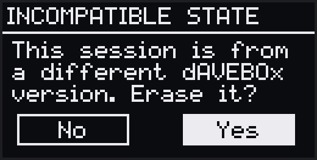

dAVEBOx stores its data inside the Move set. Duplicating a set inherits it;
deleting a set removes it on the next launch. Loading a set saved by an **older
dAVEBOx** shows an **Incompatible State** dialog — **No** (default) exits with the
old file kept, **Yes** erases it and starts clean.

**Saved per set:** all notes, effects, automation, and timing; each track's
settings; the global settings; mute/solo state and all snapshots; Performance Mode
presets; and Note Repeat masks and rates.

---

# 17. The Browser Editor

With dAVEBOx loaded, open the Schwung web manager (`http://move.local:7700`) →
**Remote UI → Tool tab** for a full clip editor in the browser. It mirrors the
device both ways — edits on either side show up on the other.

- **Session grid:** click a clip to launch it (Alt/Shift-click views it without
  launching); drag to move (Alt-drag copies); a clip's **≡ menu** duplicates,
  copies, cuts, pastes, or deletes. Track headers mute (click), solo
  (right-click), and set route/channel (**☰**).
- **Piano roll:** the **Draw** tool adds and drags notes on the toolbar **Snap**;
  right-click or **Erase** deletes; **Select** marquee-edits a group. On drum
  tracks, drag a hit vertically between lanes. The **step band** sets per-step
  conditions, and the velocity and automation lanes edit below.
- **Transport:** the header runs the device's transport on a synced clock, so the
  playhead stays smooth over WiFi; a **sync** button forces a re-read if the two
  drift apart.

---

# 18. Quick Reference

### Track View

| Control | Action |
|---|---|
| Pad | Play a note |
| Pads + step / step + pads | Chord entry |
| Step tap / hold | Toggle / edit |
| +/− / Left-Right | Octave / page |
| Side buttons | Switch clips |
| Jog turn / click | Cycle banks / alt-parameters |
| Shift + jog / Shift + bottom pad | Switch tracks |
| Loop (hold) / Loop + jog | Loop view / clip length |
| Play / Shift + Play / Loop + Play | Start-stop / restart / restart at page |
| Record / Shift + Record | Record / Live Merge |
| Capture / Shift + Capture | Keep / clear buffered play |
| Sample | Bake |
| Mute / Shift + Mute / Delete + Mute | Mute / solo / clear all |
| Delete + step / side | Clear step / clip |
| Shift + Delete + side / jog click | Reset clip / effects |
| Delete + jog click | Reset bank |
| Delete + Play | Deactivate clips (running) · panic (stopped) |
| Undo / Shift + Undo | Undo / redo |
| Note/Session (tap / hold) | Switch / peek view |
| Shift + Note/Session | Settings menu |

### Drum track (additions)

| Control | Action |
|---|---|
| Lane pad | Trigger + select lane |
| +/− | Lane bank A ↔ B |
| Shift + Step 8 | Cycle velocity / Rpt1 / Rpt2 |
| Loop + jog / lane pad | Lane length / latch repeat |
| Copy + lane · Mute + lane | Copy · mute lane |

### Shift + Step shortcuts

| Step | Action | Views |
|---|---|---|
| 2 | Settings menu (globals) | Both |
| 3 | Edit the instrument in place | Track |
| 5 | Tap Tempo | Both |
| 6 | Metro (Cnt-In ↔ Always) | Both |
| 7 | Swing | Both |
| 8 | Chromatic layout / cycle right-pad mode | Track |
| 9 | Scale | Both |
| 10 | VelIn (Live ↔ 100) | Track |
| 11 | LIVE ARP on/off | Track (melodic) |
| 15 | Double-and-fill loop | Track |
| 16 | Quantize 100 % | Track |

### Session View

| Control | Action |
|---|---|
| Clip / empty clip | Launch · queue / focus for recording |
| Shift + clip | Open in Track View |
| Scene launcher / steps 1–16 | Launch scene |
| Shift + scene launcher | Launch at next bar |
| Jog / +/− | Scroll rows (1 / 4) |
| Mute + clip / Shift + Mute + clip | Mute / solo track |
| Mute (hold) + step | Save · recall mute snapshot |
| Copy + clip / scene launcher | Copy clip / row |
| Capture + scene launcher | Snapshot to row |
| Sample + scene launcher | Bake row |
| Delete + clip / scene launcher | Delete clip / clear row |
| Loop (tap / hold) | Lock / hold Performance Mode |

### LED & screen states

**Clip pads / side buttons** — off = empty; dim track color = holds notes; solid =
focused; flashing = playing (1/8) or queued (1/16).

**Step buttons** — Track View: white = playhead, track color = filled step, dim =
beat markers. Session View: red = rows in view, white = out-of-view content.

**Knob LEDs** — lit when a parameter is off default. On the [AUTO bank](#11-automation),
white = resting value, yellow = has automation, red = recording, green = playback.

**Screen header** — the active track's number sits inside a box; a muted track's
number blinks, and a soloed track's number shows filled in. The bank strip on the
right shows where you are among the track's banks.
